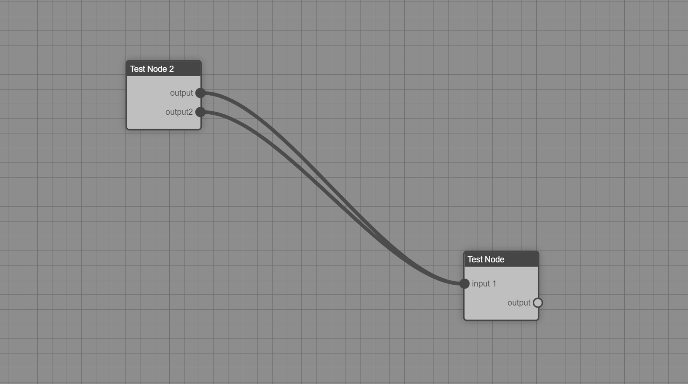

# Logic Flow Component(under development)

A framework agnostic native web component that allows you to create logic flow diagrams and non-linear editors. Think Unreal Engine's Blueprints or Blenders material editor.

